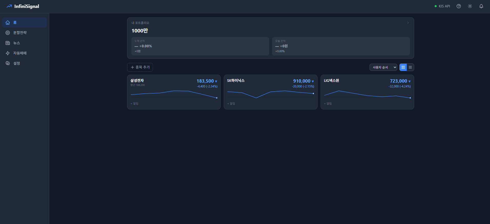
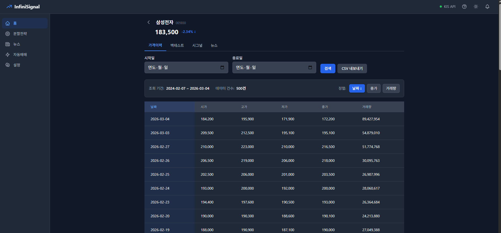
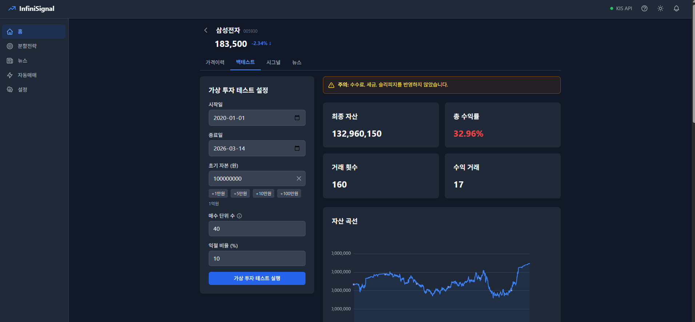
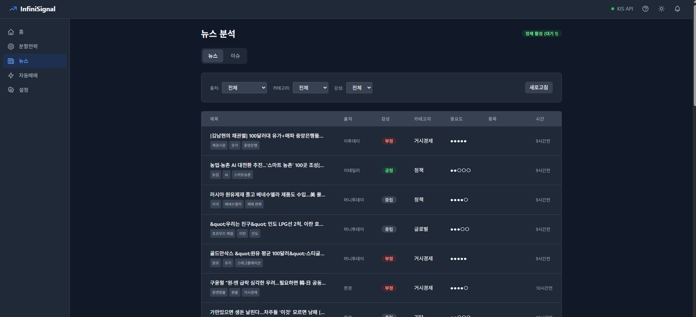

<h1 align="center">InfiniSignal</h1>

<p align="center">
  한국 주식 분할매수 전략 · 자동매매 · 실시간 모니터링 · 뉴스 분석 시스템
</p>

<p align="center">
  
</p>

<p align="center">
  
  
  
  
  
  
  
  
  
  
  
  
  
  
  
</p>

---

## Demo

<!-- 스크린샷이나 GIF를 docs/screenshots/ 에 넣고 아래 경로를 수정하세요 -->

| 대시보드 | 실시간 가격 |
|:---:|:---:|
|  |  |

| 백테스트 | 뉴스 분석 |
|:---:|:---:|
|  |  |


---

## 주요 기능

### 무한매수법 백테스트
- 분할매수 전략을 과거 데이터로 시뮬레이션
- 직전 매수가 기반 동적 트리거 (v2.0)
- 최대 40단계 분할 매수, 수익률 +10% 익절
- 거래 이력 · 수익률 차트 · 요약 리포트

### 실시간 모니터링
- KIS OpenAPI WebSocket 기반 실시간 시세
- 종목별 가격 알림 조건 설정
- 장중/시간외/장마감 자동 전환
- 최대 40종목 동시 모니터링

### 뉴스 파이프라인
- RSS 피드 + DART 공시 자동 수집 (5분 주기)
- Gemini AI로 키워드 · 감성 · 중요도 자동 분석
- 임베딩 + 클러스터링으로 관련 뉴스 그룹핑
- 종목별 뉴스 타임라인 & 주가 연동 차트

### 텔레그램 개인 DM 알림
- 유저별 관심종목에 대해서만 알림
- 연결 코드 방식으로 안전한 봇 연동
- 쿨다운 기반 중복 알림 방지

### 포트폴리오 관리
- 멀티 종목 포지션 추적
- 룰 기반 리밸런싱 알림
- 실시간 손익 계산

---

## 아키텍처

```
┌─────────────┐     HTTPS      ┌──────────┐      ┌─────────────┐
│   Browser   │ ──────────────→│  NGINX   │─────→│  FastAPI     │
│  (Vue 3)    │←── WebSocket ──│ (SSL)    │      │  (Uvicorn)  │
└─────────────┘                └──────────┘      └──────┬──────┘
                                                        │
                              ┌─────────────────────────┼─────────────────────┐
                              │                         │                     │
                        ┌─────▼─────┐           ┌──────▼──────┐     ┌───────▼───────┐
                        │  MySQL    │           │ PostgreSQL  │     │ KIS OpenAPI   │
                        │  8.0      │           │ + pgvector  │     │ (WebSocket    │
                        │           │           │ (News DB)   │     │  + REST)      │
                        │ · 가격    │           │ · 뉴스 원본 │     │ · 실시간 시세 │
                        │ · 전략    │           │ · 정제 결과 │     │ · 종목 검색   │
                        │ · 유저    │           │ · 임베딩    │     └───────────────┘
                        │ · 알림    │           └─────────────┘
                        └───────────┘
                                                        ┌───────────────┐
                              ┌──────────┐              │ Gemini AI     │
                              │ Telegram │              │ · 뉴스 정제   │
                              │ Bot      │              │ · 감성 분석   │
                              │ (DM)     │              │ · 임베딩 생성 │
                              └──────────┘              └───────────────┘
```

### 데이터 흐름

```
1. 가격 데이터
   KIS REST API → PriceHub 캐시 → MySQL (prices_daily)
   KIS WebSocket → PriceHub → Browser WebSocket

2. 뉴스 파이프라인
   RSS/DART 수집 (5분) → PostgreSQL (raw)
   → Gemini 정제 (1분) → PostgreSQL (normalized)
   → 임베딩 생성 → 클러스터링

3. 알림
   Signal Engine → User 구독 확인 → Telegram DM
   (dedupe: user_id + symbol + signal_type)
```

---

## 사용법

### 1. 관심종목 등록

상단 검색바에서 종목을 검색하고 워치리스트에 추가합니다.
최대 40종목까지 실시간 모니터링이 가능합니다.

### 2. 백테스트 실행

종목 상세 → 백테스트 탭에서:
- 초기 자본금, 분할 단계, 익절 비율 설정
- 과거 데이터 기반 전략 시뮬레이션
- 거래 이력과 수익률 차트 확인

### 3. 실시간 모니터링

대시보드에서 등록된 종목의 실시간 시세를 확인합니다.
장중에는 WebSocket, 시간외에는 5분 폴링으로 자동 전환됩니다.

### 4. 텔레그램 알림 연결

설정 → 텔레그램 연결에서:
1. 연결 코드를 발급받습니다
2. 텔레그램에서 봇에게 `/link [코드]`를 전송합니다
3. 관심종목의 매수/매도 신호가 DM으로 발송됩니다

### 5. 뉴스 분석

뉴스 페이지에서 종목별 뉴스를 확인합니다.
AI가 자동으로 키워드, 감성, 중요도를 분석하여 표시합니다.

---

## 기술 스택 상세

| 영역 | 기술 | 역할 |
|------|------|------|
| **프론트엔드** | Vue 3 + Composition API | UI 프레임워크 |
| | TypeScript | 타입 안정성 |
| | Tailwind CSS | 유틸리티 기반 스타일링 |
| | Pinia | 상태 관리 |
| | Vite | 빌드 도구 |
| | ECharts | 차트 시각화 |
| **백엔드** | FastAPI | API 서버 |
| | SQLAlchemy + Alembic | ORM + 마이그레이션 |
| | Pydantic v2 | 데이터 검증 |
| | WebSocket | 실시간 통신 |
| **데이터** | MySQL 8.0 | 메인 DB (가격, 유저, 전략) |
| | PostgreSQL + pgvector | 뉴스 DB + 벡터 검색 |
| | KIS OpenAPI | 한국 주식 시세/검색 |
| **AI** | Google Gemini 2.5 Flash | 뉴스 정제/감성분석 |
| | gemini-embedding-001 | 뉴스 임베딩 생성 |
| **인프라** | Docker Compose | 컨테이너 오케스트레이션 |
| | NGINX + Let's Encrypt | 리버스 프록시 + SSL |
| | Oracle Cloud | 호스팅 |
| **알림** | Telegram Bot API | 유저별 DM 알림 |
| **인증** | Google OAuth + JWT | 사용자 인증 |

---

## 변경 이력

자세한 변경 이력은 [CHANGELOG.md](./CHANGELOG.md)를 참고하세요.

---

<p align="center">
  <sub>Built with care for Korean stock traders</sub>
</p>
